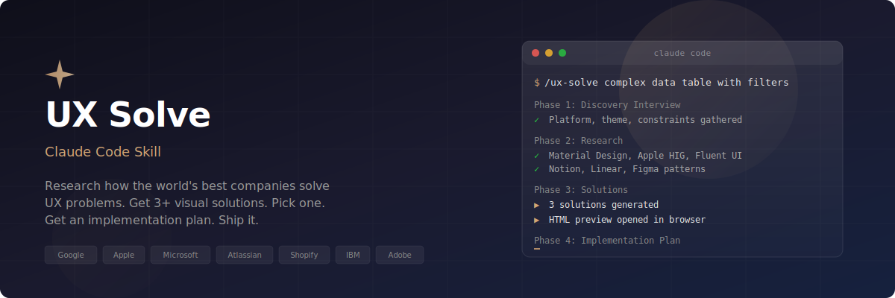

<p align="center">
  
</p>

<p align="center">
  <strong>Your AI-powered UX research assistant. Stop guessing. Start shipping.</strong>
</p>

<p align="center">
  <a href="#installation">Install</a> &middot;
  <a href="#how-it-works">How It Works</a> &middot;
  <a href="#examples">Examples</a> &middot;
  <a href="#contributing">Contributing</a>
</p>

---

## What is this?

**UX Advisor** is an open-source [Claude Code](https://claude.ai/claude-code) plugin that turns Claude into a UX research assistant. Instead of guessing at UI solutions or spending hours browsing design systems, you describe your problem and get:

1. A **discovery interview** to understand your exact constraints
2. **Research** across the world's top design systems and products
3. **3+ visual solutions** rendered as an interactive HTML page you can compare side by side
4. A **full implementation plan** for the solution you choose

It draws from **Google Material Design**, **Apple HIG**, **Microsoft Fluent**, **Atlassian**, **Shopify Polaris**, **IBM Carbon**, **Adobe Spectrum**, and real-world patterns from apps like Slack, Notion, Figma, Linear, and more.

## Why?

Every UX problem you're facing has likely been solved — and solved well — by a team with a dedicated research budget. The patterns are documented across design systems, research articles, and production apps. But finding, comparing, and synthesizing all of that takes hours.

This plugin does that research for you in minutes, then gives you something you can actually ship.

## Installation

### One-command install (recommended)

In Claude Code, add the marketplace and install the plugin:

```
/plugin add-marketplace https://raw.githubusercontent.com/tom-barkan/UX-Solutions-Skill/main/marketplace.json
/plugin install ux-advisor
```

That's it. The plugin is immediately available in your project.

### Manual install

If you prefer to install manually:

```bash
git clone https://github.com/tom-barkan/UX-Solutions-Skill.git
mkdir -p your-project/.claude/skills
cp -r UX-Solutions-Skill/skills/ux-advisor your-project/.claude/skills/ux-advisor
```

## How It Works

### Phase 1: Discovery Interview

The plugin starts by asking you the right questions — platform, tech stack, theme, current experience, user profile, and constraints. It also scans your codebase automatically to understand your framework, component library, and existing patterns.

```
> /ux-advisor I need a better way to handle complex data filtering

Claude: Before I research solutions, let me understand your context:
  - What platform? (web, mobile, desktop)
  - What's your tech stack? (I can see React + Tailwind in your package.json)
  - Dark mode, light mode, or both?
  - Can you point me to the current implementation?
  - Who are the end users — technical or non-technical?
  ...
```

### Phase 2: Research

Claude searches across 7+ major design systems and dozens of real products to find how they solve your specific problem. It reads actual documentation pages — not just search snippets — to understand the *reasoning* behind design decisions.

| Source Type | Examples |
|---|---|
| **Design Systems** | Material Design, Apple HIG, Fluent UI, Polaris, Carbon, Spectrum, Atlassian |
| **Products** | Gmail, Slack, Notion, Linear, Figma, VS Code, GitHub, Stripe, Airbnb |
| **Research** | Nielsen Norman Group, Baymard Institute, Smashing Magazine |

### Phase 3: Visual Solutions

You get **3+ genuinely different solutions** — not cosmetic variations, but different UX strategies. Each one is rendered as an interactive HTML preview that opens in your browser:

- **Interactive mockups** you can click through to feel the interaction pattern
- **Tradeoff comparison** so you can see what each approach optimizes for
- **Accessibility notes** for each solution
- **Inspiration sources** showing which providers informed each approach

Pick one, or mix and match elements from multiple solutions.

### Phase 4: Implementation Plan

Once you choose, Claude creates a step-by-step implementation plan tailored to your codebase:

- Component architecture and data flow
- Ordered implementation steps with code snippets
- Accessibility checklist (WCAG 2.1 AA)
- Edge case handling (empty states, errors, loading, overflow)
- Testing recommendations

Then ask Claude to start building — it follows the plan and implements directly in your project.

## Examples

```bash
# Complex UI patterns
/ux-advisor data table with 10k+ rows, sorting, inline editing, and multi-select

# Navigation challenges
/ux-advisor my SaaS app has 15+ nav items and it's a mess on mobile

# Search & filtering
/ux-advisor faceted search for e-commerce with 200+ filter options across 8 categories

# Onboarding
/ux-advisor first-time user onboarding flow for a complex B2B analytics tool

# Forms
/ux-advisor multi-step form wizard with conditional logic and progress saving

# Data visualization
/ux-advisor interactive dashboard with 12 charts that needs to work on tablets too
```

## Requirements

- [Claude Code](https://claude.ai/claude-code) CLI
- Web search enabled (the plugin uses `WebSearch` and `WebFetch` to research design systems)

## Contributing

Found a way to make the plugin better? Contributions are welcome.

1. Fork the repo
2. Edit `skills/ux-advisor/SKILL.md`
3. Test with a few UX problems
4. Submit a PR

Ideas for improvement:
- Add more design system sources
- Improve the HTML preview template
- Add domain-specific variants (mobile, e-commerce, B2B, etc.)
- Improve the discovery interview questions

## License

[MIT](LICENSE)

